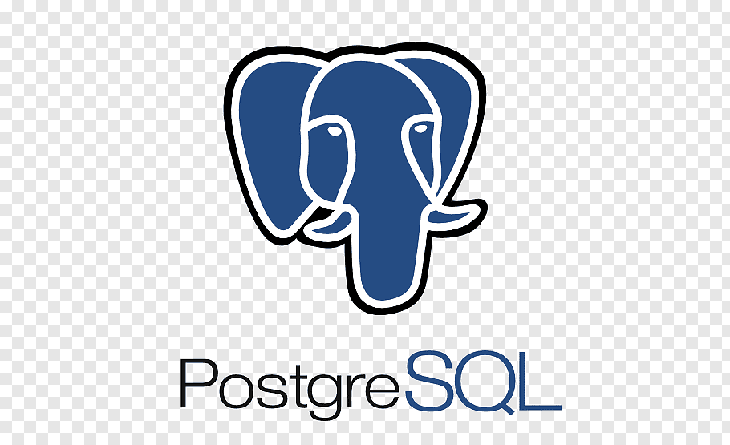

## Hi there, I am Igor 


I'm Igor Korobov a Python Backend Developer just graduated from the Digital 
Career Institute https://digitalcareerinstitute.org/.

My background is in economics and energy policy and the experience consulting. 


:mailbox: Reach me out!
[](https://www.linkedin.com/in/igor-korobov/)
[](mailto:i.korobov@yahoo.com)

<!-- TODO: Add last video link -->

- 🔭 Looking a new adventure in the IT world.
- :computer: Python, SQL&PostGreSQL, AI, Data Science.
- 📫 How to reach me: just write at WhatsApp at +4917631504582.
- 🤔 English, German, Russian.
- ⚡ Fun fact: I play beach volleyball and go to GYM every day.

#### Top Technologies

<a href="https://www.python.org/" title="Python"></a>
<a href="https://github.com/" title="GitHub"></a>
<a href="https://www.mysql.com/" title="MySQL"></a>
<a href="https://code.visualstudio.com/" title="Visual Studio Code"></a>





#### Bizness
- :paperclip: [My Resume/CV](https://github.com/ikoro1/ikoro1/blob/main/Resume/CV%20Igor%20Korobov%202023%20en.pdf)
- :email: i.korobov@yahoo.com


#### Profile Visits 


<details>
<summary>
  More stuff about me
</summary>

<br >

I love learning. This ist my next  height to take!


[//]: # (#### What is CoderOne?)

[//]: # ()
[//]: # (CoderOne is a youtube channel for learning Web/Mobile development, coding and design. Including new technologies and frameworks and anything really related to development world.)

[//]: # ()
[//]: # (#### Coding Stats)

<!--START_SECTION:waka-->
```text
TypeScript   15 hrs 41 mins  ████████████████████▓░░░░   82.29 % 
HTML         1 hr 50 mins    ██▒░░░░░░░░░░░░░░░░░░░░░░   09.61 % 
Markdown     1 hr 27 mins    ██░░░░░░░░░░░░░░░░░░░░░░░   07.63 % 
Other        2 mins          ░░░░░░░░░░░░░░░░░░░░░░░░░   00.25 % 
YAML         2 mins          ░░░░░░░░░░░░░░░░░░░░░░░░░   00.19 % 
```
<!--END_SECTION:waka-->

[//]: # (#### Github Stats)

[//]: # (![Ipenywis's github stats]&#40;https://github-readme-stats.vercel.app/api?username=ipenywis&count_private=true&theme=tokyonight&hide=contribs,prs&#41;)

[//]: # (</details>)

[//]: # ()
[//]: # ([reactplaylist]: https://www.youtube.com/watch?v=KxXXEL-k47Y&list=PLvXDmnBbOF7RnYiZvDwl2Pzcs2kfi10wd)

[//]: # ([vscodetutorial]: https://www.youtube.com/watch?v=Bkie2ai8qeE&t=8s)

[//]: # ([htmltutorial]: https://www.youtube.com/watch?v=VK6MXVxOsws&t=27s)

[//]: # ([javascripttutorial]: https://www.youtube.com/watch?v=D-LHKvmX37E)
